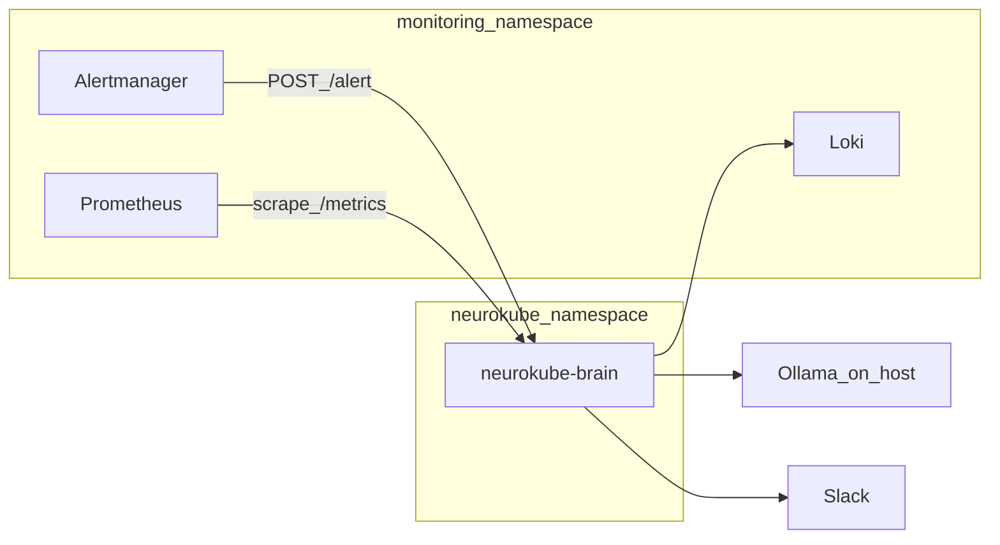

# NeuroKube

Demo stack: **Kubernetes (kind)** + **Prometheus / Grafana / Loki / Alertmanager** + a small **Go “brain”** that receives firing alerts, pulls **Loki** logs, asks **Ollama** for a structured diagnosis, posts to **Slack**, and can **patch** a Deployment memory limit from a button.

**Docs:** step-by-step checklist in [`neurokube_fromscratch.md`](neurokube_fromscratch.md) · deeper design in [`neurokube_blueprint.md`](neurokube_blueprint.md) · this repo’s run log in [`progress.md`](progress.md).

## Architecture



## Prerequisites

- **Docker Desktop** (Windows/macOS) or Docker on Linux  
- **kind**, **kubectl**, **Helm** (see [`progress.md`](progress.md) Part A for versions used)  
- **Go** 1.22+ (for local builds / CI)  
- **Ollama** on the host with a small model (e.g. `llama3.2:latest`)  
- **Slack app** (bot token + Socket Mode app token) — use [`slack-app-manifest.yaml`](slack-app-manifest.yaml)

## Quick start

1. Clone the repo and copy **`.env.example`** → **`.env`**. Fill **Slack** tokens and **`SLACK_CHANNEL`**. Set **`OLLAMA_MODEL`** to a model you actually pulled.  
   - **Never commit `.env`.**  
   - For pods on **Docker Desktop**, **`OLLAMA_URL=http://host.docker.internal:11434`** (already in `.env.example`).  
   - On **Linux**, either set **`OLLAMA_URL`** to your host LAN IP or add **`hostAliases`** for `host.docker.internal` on the brain pod (see [`neurokube_fromscratch.md`](neurokube_fromscratch.md) Part T).

2. **Cluster + observability + brain** (from repo root):

   ```bash
   make cluster-up
   make obs-install
   make brain-build
   make brain-deploy
   ```

   Or follow the Helm/kubectl sequence in **`neurokube_fromscratch.md`**.

3. **Grafana:** `http://localhost:30000` — default admin password is set in [`observability/prometheus-values.yaml`](observability/prometheus-values.yaml) (`neurokube123` in the reference setup).

4. **Synthetic alert** (tests brain + Slack + Ollama without waiting for Prometheus):

   ```powershell
   powershell -ExecutionPolicy Bypass -File scripts/post-synthetic-alert.ps1
   ```

5. **Optional real OOM path:** apply [`victim/deployment-oom.yaml`](victim/deployment-oom.yaml) so the stress sidecar runs as PID 1 and exceeds its memory limit; watch Alertmanager and Slack. Revert with **`kubectl apply -f victim/deployment.yaml`**.

## Make targets

| Target | Purpose |
|--------|---------|
| `make cluster-up` | `kind create` from [`cluster/kind-config.yaml`](cluster/kind-config.yaml) |
| `make obs-install` | Helm install kube-prometheus-stack + loki-stack |
| `make brain-build` | `docker build` + `kind load` brain image |
| `make brain-deploy` | Namespace, Secret (`.env` minus `KUBECONFIG`), RBAC, brain + ServiceMonitor, victim |
| `make demo` | Bash [`victim/stress-test.sh`](victim/stress-test.sh) (Git Bash / WSL on Windows) |
| `make logs` | Tail brain logs |
| `make clean` | Delete kind cluster + local image |

## Repo layout

| Path | Purpose |
|------|---------|
| [`brain/`](brain/) | Go module: HTTP `/alert`, `/metrics`, Loki + Ollama + Slack + patch |
| [`cluster/`](cluster/) | kind config, namespaces |
| [`observability/`](observability/) | Prometheus stack + Loki Helm values |
| [`victim/`](victim/) | Sample workload (`nginx` + `stress`) |
| [`scripts/`](scripts/) | Helper scripts (e.g. synthetic alert) |
| [`docs/loki-labels.md`](docs/loki-labels.md) | Loki label keys (`pod` vs `pod_name`) |

## CI

[`.github/workflows/ci.yml`](.github/workflows/ci.yml) runs **`go vet`**, **`go build`** on `brain/`, and a **`docker build`** smoke check.

## License

[MIT](LICENSE)
