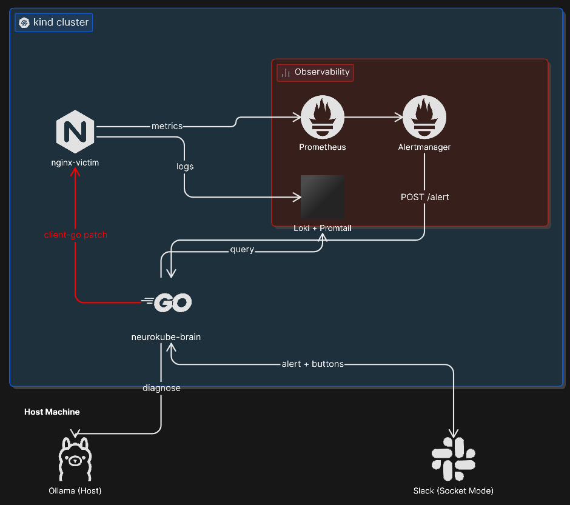
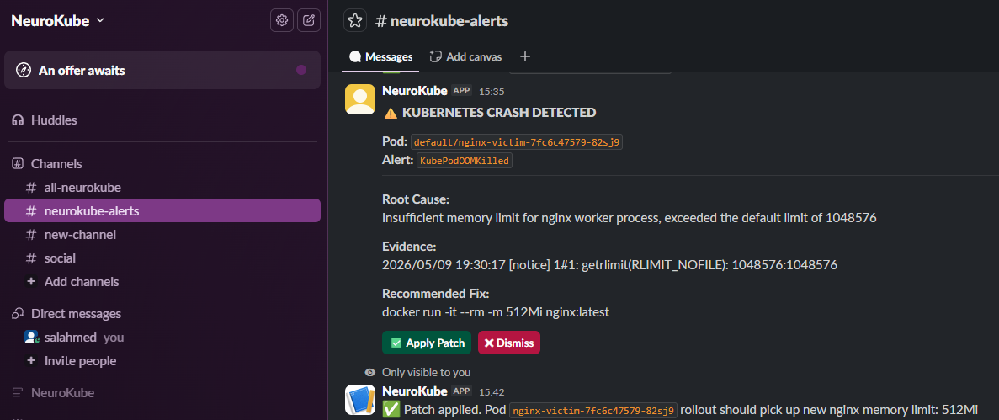

# NeuroKube


**NeuroKube watches your Kubernetes cluster, uses an LLM to diagnose incidents from live logs, and automatically remediates — all without human intervention.**

When Prometheus fires a workload alert, Alertmanager POSTs to a Go **brain** service. The brain pulls **Loki** logs for the affected pod, sends context to **Ollama** (`/api/generate`) for a structured diagnosis, posts a rich message to **Slack** with one-click actions, and can **patch** the Deployment memory limit via **client-go** — no separate operator binary, no public ingress for Slack.

---

## What this demonstrates

- **Go** — HTTP webhook + Slack Socket Mode, goroutine-safe async handling of firing alerts
- **Kubernetes** — client-go Deployment patch, RBAC, in-cluster credentials (operator-style remediation without a separate controller binary)
- **Observability** — Prometheus scraping via ServiceMonitor, Loki LogQL, Alertmanager routing to the brain
- **LLM** — Ollama `/api/generate`, prompt engineering for structured incident diagnosis
- **Production habits** — multi-stage Docker build, Helm values for the full stack, CI with `go vet` + `go build` + Docker smoke build

---

## Architecture



**Flow in plain English:** an alert fires in Prometheus → **Alertmanager** routes OOM/crash-class alerts to the brain’s `/alert` URL → the brain loads recent lines from **Loki** for that pod → **Ollama** produces a diagnosis (root cause, evidence, suggested fix, optional new limit) → **Slack** shows a card with **Apply Patch** / **Dismiss** → **Apply Patch** runs a strategic-merge patch on the Deployment so the next rollout picks up a higher memory limit.

---

## Demo

Slack incident card from NeuroKube: diagnosis, evidence, recommended fix, and **Apply Patch** / **Dismiss** actions.



---

## Prerequisites

- Docker (Desktop or Linux daemon)
- **kubectl**, **kind**, **Helm** 3.x
- **Go** 1.22+ (CI / local builds)
- **Ollama** on the host with a pulled model (tag must match `OLLAMA_MODEL`)
- Slack app: Bot User OAuth + Socket Mode app-level token ([`slack-app-manifest.yaml`](slack-app-manifest.yaml))

## Configuration

1. Copy `.env.example` to `.env`. Set Slack tokens, channel, and `OLLAMA_MODEL`.
2. Do not commit `.env`. Brain Deployment loads secrets from `neurokube-secrets`; `make brain-deploy` strips `KUBECONFIG` so the pod uses in-cluster credentials.
3. **Docker Desktop:** use `OLLAMA_URL=http://host.docker.internal:11434` in `.env`.
4. **Linux:** point `OLLAMA_URL` at the host routable from pods, or add `hostAliases` on the brain pod for `host.docker.internal` if your runtime supports it.

Replace default Grafana credentials in [`observability/prometheus-values.yaml`](observability/prometheus-values.yaml) before any shared environment.

## Deploy

```bash
make cluster-up
make obs-install
make brain-build
make brain-deploy
```

Grafana (reference install): NodePort **30000** — credentials from Helm values.

## Validation

- **Synthetic alert** (no Prometheus dependency):

  ```powershell
  powershell -ExecutionPolicy Bypass -File scripts/post-synthetic-alert.ps1
  ```

- **Workload stress:** `make demo` or `bash victim/stress-test.sh`
- **Stronger OOM signal:** `make demo-oom` applies [`victim/deployment-oom.yaml`](victim/deployment-oom.yaml); revert with `kubectl apply -f victim/deployment.yaml`

## Loki queries

The brain queries `{namespace="<ns>", pod="<name>"}` then falls back to `pod_name` if streams use that label (Promtail/chart variants).

## Repository layout

| Path | Role |
|------|------|
| `brain/` | Go service: webhook, metrics, Loki, LLM, Slack, Deployment patch |
| `cluster/` | kind config, namespaces |
| `observability/` | Prometheus stack + Loki Helm values |
| `victim/` | Sample Deployment for incident simulation |

## CI

[`.github/workflows/ci.yml`](.github/workflows/ci.yml): `go vet`, `go build`, Docker image build (no push).

## License

[MIT](LICENSE)
