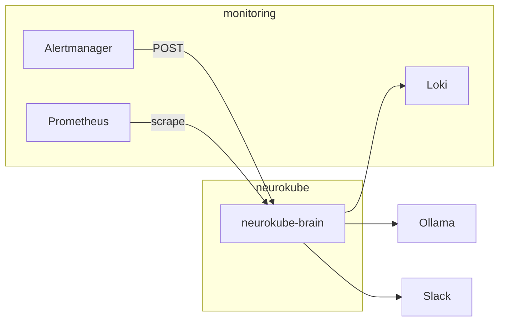

# NeuroKube

Production-style reference implementation: **Alertmanager** routes workload alerts to a **Go control plane** that correlates **Loki** logs with an **LLM** (Ollama), notifies **Slack**, and can **remediate** memory limits on Deployments via **client-go** — suitable for **kind** or lab clusters.

## Overview

| Layer | Components |
|-------|------------|
| Cluster | [kind](cluster/kind-config.yaml), namespaces `monitoring` / `neurokube` |
| Observability | kube-prometheus-stack (Prometheus, Grafana, Alertmanager), Loki + Promtail via loki-stack |
| Control plane | `neurokube-brain`: `/alert` webhook, `/metrics`, Slack Socket Mode interactions |



## Prerequisites

- Docker (Desktop or Linux daemon)
- **kubectl**, **kind**, **Helm** 3.x
- **Go** 1.22+ (CI / local builds)
- **Ollama** on the host with a pulled model (tag must match `OLLAMA_MODEL`)
- Slack app: Bot User OAuth + Socket Mode app-level token ([`slack-app-manifest.yaml`](slack-app-manifest.yaml))

## Configuration

1. Copy `.env.example` to `.env`. Set Slack tokens, channel, and `OLLAMA_MODEL`.
2. Do not commit `.env`. Brain Deployment loads secrets from `neurokube-secrets`; `make brain-deploy` strips `KUBECONFIG` so the pod uses in-cluster credentials.
3. **Docker Desktop:** use `OLLAMA_URL=http://host.docker.internal:11434` in `.env`.
4. **Linux:** point `OLLAMA_URL` at the host routable from pods, or add `hostAliases` on the brain pod for `host.docker.internal` if your runtime supports it.

Replace default Grafana credentials in [`observability/prometheus-values.yaml`](observability/prometheus-values.yaml) before any shared environment.

## Deploy

```bash
make cluster-up
make obs-install
make brain-build
make brain-deploy
```

Grafana (reference install): NodePort **30000** — credentials from Helm values.

## Validation

- **Synthetic alert** (no Prometheus dependency):

  ```powershell
  powershell -ExecutionPolicy Bypass -File scripts/post-synthetic-alert.ps1
  ```

- **Workload stress:** `make demo` or `bash victim/stress-test.sh`
- **Stronger OOM signal:** `make demo-oom` applies [`victim/deployment-oom.yaml`](victim/deployment-oom.yaml); revert with `kubectl apply -f victim/deployment.yaml`

## Loki queries

The brain queries `{namespace="<ns>", pod="<name>"}` then falls back to `pod_name` if streams use that label (Promtail/chart variants).

## Repository layout

| Path | Role |
|------|------|
| `brain/` | Go service: webhook, metrics, Loki, LLM, Slack, Deployment patch |
| `cluster/` | kind config, namespaces |
| `observability/` | Prometheus stack + Loki Helm values |
| `victim/` | Sample Deployment for incident simulation |

## CI

[`.github/workflows/ci.yml`](.github/workflows/ci.yml): `go vet`, `go build`, Docker image build (no push).

## License

[MIT](LICENSE)
